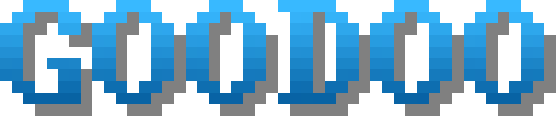

Goodoo is a procedural 2D platformer video game which started as a broken student project and is built with
[Pygame](https://github.com/pygame/pygame).
Its name has been chosen randomly and has no specific meaning.
This game is the result of many redesigns through the years by an inexperienced developer who has no idea how game
design works.
And yes, I commit on master, I should burn in hell for that (and don't look at the commit history it's an absolute
mess).

## :computer: Running from sources

### Requirements

This program has been tested on python `3.12`.
You can use pip to install the required libraries.

```bash
python -m venv venv
source venv/bin/activate
pip install -r requirements.txt
```

### Run

```bash
python3 goodoo.py
```

The keyboard layout is in QWERTY by default, you can run with AZERTY keys with:

```bash
python3 goodoo.py AZERTY
```

## :video_game: Gameplay


You're an animated small ball of goo that fell into a cave full of lava at the bottom and your goal is to reach the top
of the cave to escape.
You've got to do this quickly as lava will start to rise once a certain height is reached.

Because you're just a ball of goo, you can't move by yourself.
One click will project your goo material on the walls like a true Spider-Man, and move yourself from left to right while
you're
in the air.

Be careful on your way as mushrooms will bump you in the opposite way.
There's also pointy purple minerals that will kill you instantly, so watch your steps around them.

### Default keys

| Action             |      Key      |
|--------------------|:-------------:|
| fire grapple       | `left click`  |
| left (in the air)  | `a` / `left`  |
| right (in the air) | `d` / `right` |
| pause              |      `p`      |
| end game           |   `escape`    |

## :volcano: Cave generation

The goal is to generate a tile cave only opened at the top, where the player can climb to.

The map generation works as a grid where we play a cave generator cellular automaton, which creates several rooms inside
the map.
We then dig connections between neighboring rooms to make sure any rooms can be accessible starting from any other
room.
A hardcoded hole is dig at the top of the map to create a finish line for the player.

Obstacle tiles are generated randomly on walls, with free space in front of them guaranteeing the player will not be
stuck in its progression.

Non physic tiles, called "decorations" are placed randomly in a separated map, with each decoration type satisfying
its own generation constraint.

---

&nbsp;*That's all folks!*</img>
