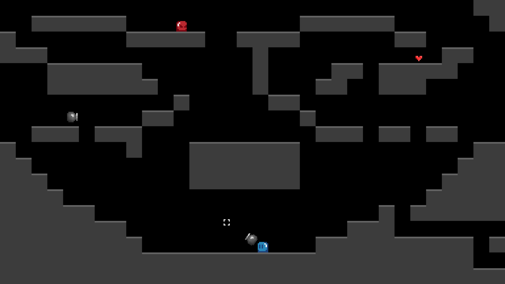

# Goodoo



## Requirement and dependency

Python 3.9 or above

[Pygame](https://pypi.org/project/pygame/) ```pip install pygame```

## Execution examples

```
python goodoo.py resources/maps/map1.jpg
python goodoo.py resources/maps/map2.jpg
python goodoo.py resources/maps/map3.jpg
python goodoo.py resources/maps/map4.jpg
```

## Key Bindings

left  ```left``` / ```q```<br/>
right ```right``` / ```d```<br/>
jump ```up``` / ```z``` / ```space```<br/>
pick ```shift``` / ```r```<br/>
action ```left click```<br/>
debug ```*```<br/>
quit ```escape```<br/>
